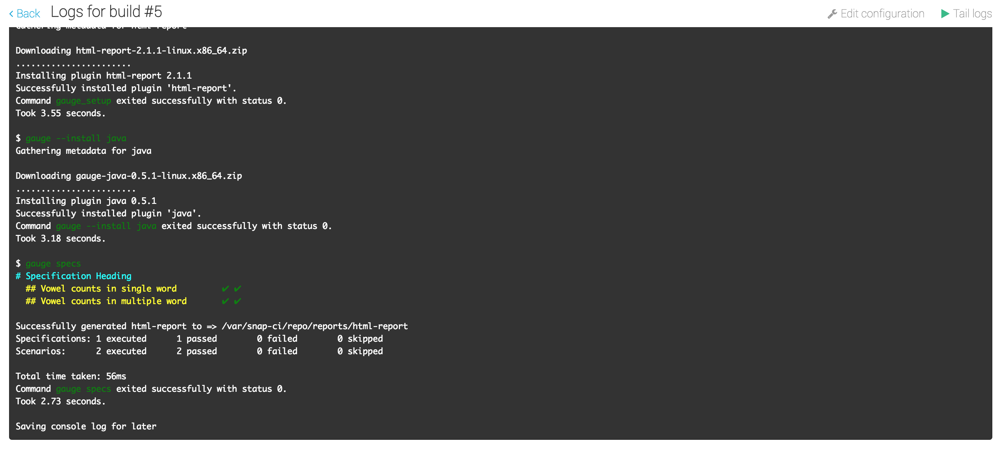

# Snap
[Snap](https://snap-ci.com/), is a continuous integration and deployment(in the cloud) tool.

## Integrating Gauge with Snap

* Login to Snap and choose `Add repository` option to setup a new pipeline by selecting the repository which is a Gauge project.

### Install Gauge

* Gauge can be installed either by using the portable installer or by using any package manager. If you want to use Gauge installer, you can use a script like [this](https://raw.githubusercontent.com/getgauge/gauge-example-java/master/install_latest_gauge.sh).

If your agent is Linux(RHEL, CentOS), you can install gauge via `yum` by adding following commands:

```
$ echo -e "[gauge-stable]\nname=gauge-stable\nbaseurl=http://dl.bintray.com/gauge/gauge-rpm/gauge-stable\ngpgcheck=0\nenabled=1" | sudo tee /etc/yum.repos.d/gauge-stable.repo
$ sudo yum install gauge
$ gauge_setup
```

More details on installation on all operating systems can be found [here](http://getgauge.io/documentation/user/current/installations/operating_system/). 

* Install Gauge language plugin as:
```
gauge --install <language>
```

### Create execution task

* Add a task which will run `gauge specs`.
* If you want to run only a subset of specs, you can use [tags](../execution_types/tagged_execution.md). Eg. ```gauge --tags "tag1 & tag2" specs```
* Adding a flag `-p` runs them in [parallel](../execution_types/parallel_execution.md).
* Run against specific [environments](../managing_environments.md) using the ```--env``` flag
* See the [Gauge CLI](../../cli/README.md) for list of all flags that can be used.

    

### Reports

* Gauge generates **html-report** after execution whose location can be set by environment variable `gauge_reports_dir`. This defaults to `reports` directory in the Gauge project.

* You can add Gauge execution reports as `artifacts` in Snap so that it can be downloaded after the stage run.

    

* **Console output** can be seen while execution of stage.

     

