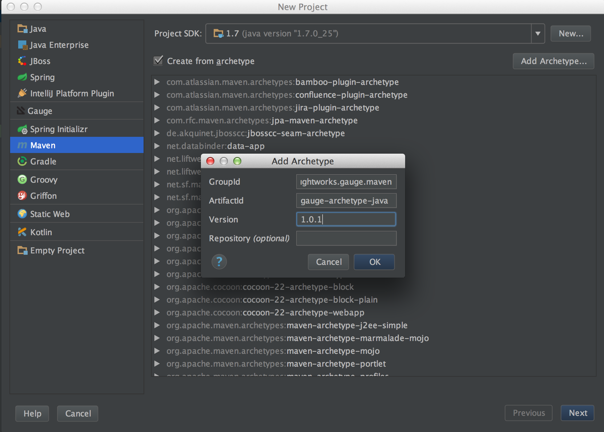
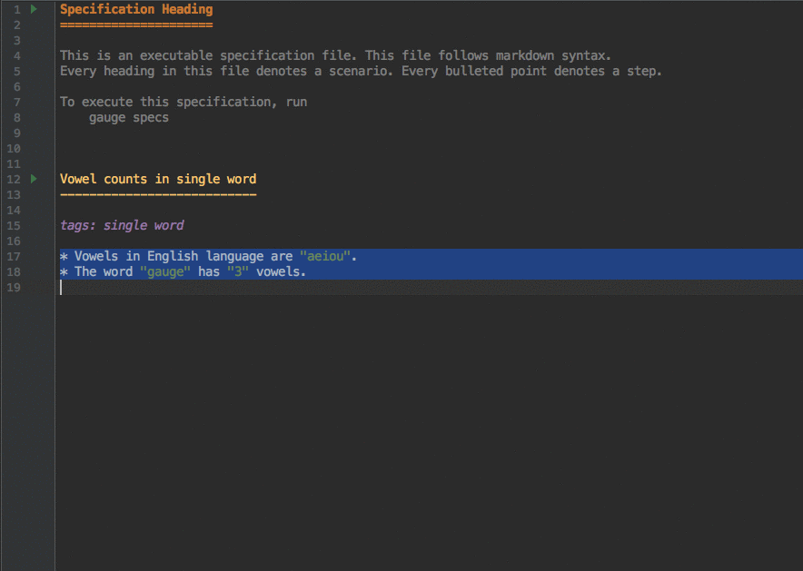

# Gauge IntelliJ idea plugin Features

* [Project Creation](#project-creation)
* [Auto completion](#auto-completion)
* [Quick Fix for unimplemented steps](#step-quick-fix)
* [Formatting](#formatting)
* [Execution and Debugging](#execution)
* [Run configurations](#run-configuration)
* [Rephrase steps](#rephrase-steps)
* [Find Usages](#find-usages)
* [Extract Concept](#extract-concept)
* Navigation from step to implementation (cmd/ctrl + b)

## Project Creation

### Creating a simple Java project
 * File -> New Project.
 * Choose 'Gauge'
 * Choose the project location and java sdk
 * Finish

*Note:* If `gauge-java` is not installed, it will download it for the first time.


### Creating a maven project using gauge-maven-plugin

* File -> New Project
* Choose `Maven`
* Select `Create from Archetype`
* Select the gauge archetype - `com.thoughtworks.gauge.maven`
* If the `com.thoughtworks.gauge.maven` archetype is not added select `Add Archetype`
    * Enter GroupId: com.thoughtworks.gauge.maven
    * Enter ArtifactId: gauge-archetype-java
    * Enter Version: 1.0.1 or the [latest version number](http://search.maven.org/#search%7Cga%7C1%7Cgauge-archetype-java)




* Enter the `groupId` and `artifactId` for your project.
* Enter `Project Name` and finish
* The project will be created in batch mode, watch the console for progress.
* After project creation `close and re-open the project` to enable auto-complete features.
* Enable `auto-import` for the project. Under `File > Settings > Maven > Importing`, mark the checkbox  `Import Maven projects automatically`.

 See [gauge-maven-plugin](../advanced_readings/dependency_management_plugins/maven-plugin.md) for more details on using the gauge maven plugin.

## Auto Completion
Steps present in the current project can be listed by invoking the auto completion pop up `ctrl+space` after the '*'. After choosing a step, it gets inserted with parameters highlighted, you can press `tab` to cycle between the parameters and edit them.


## Step Quick Fix

If you have an unimplemented step in the spec file, it will be annotated saying 'undefined step'. `alt+enter` can be pressed to open the quick fix pop up. The destination of the implementation can be chosen, either a new class or from a list of existing classes. It will then generate the step with required annotation and parameters.


## Formatting

A spec file can be formatted by pressing `ctrl+alt+shift l` (in windows and linux) and `cmd+alt+shift l`(in mac).

This formats all the elements of current spec including indentation of tables and steps.

## Execution

* Specs can be executed by `right click -> Run spec`.
* Execute all specs inside a directory by `right click -> Run specifications`

### Single Scenario Execution

A single scenario can be executed by doing a right click on the scenario which should be executed and choosing the scenario.
`right click -> run -> Scenario Name`

*Note:* If the right click is done in context other than that of scenario, by default, first scenario will be executed.


### Parallel Execution

To run multiple specifications in parallel

* Right click on the `specs` directory and select `Create Specifications` option.
* In the new Run configuration select `In Parallel` options. This will distribute specs execution based on number of cores the machine has.
* You can also specify the `Number of parallel execution streams`. This is optional
    ```
    Caution: Select parallel nodes based on current systems performance.
    For example on a 2 core machine select upto 4 parallel streams.
    A very large number may affect performance.
    ```
* Select `ok`. Now you can run this new configuration for parallel execution of specs.


## Debugging
Debugging can be performed the same way spec execution works.

* Right click on a specification or specs directory -> Debug. Execution will halt on marked [breakpoints](https://www.jetbrains.com/idea/help/breakpoints.html).

## Run Configuration

You can edit the run configuration to make changes to:
* The scenario or spec file to be executed
* The environment to run against
* Add a tag filter to the execution
* Choose the number of parallel streams


## Rephrase Steps
* Press **Shift+F6** on a step to rephrase it.
* The parameters will be in `< >` in the rephrase dialog. They can be reordered,removed or new parameters can be added.
* The rephrase change will reflect across **all the specs** in the project.

## Find Usages

* Press **cmd/ctrl+alt+F7** on step/concept to see the usages.


## Extract Concept

* In the editor, select the steps to be transformed into a concept.
* On the main menu or on the context menu of the selection, choose Refactor | Extract to Concept or press ⌥⌘C.
* In the Extract Concept dialog box that opens
	* Specify the concept name with parameters to be passed from the usage. For Example: Say "hello" to "gauge".
	* Select the file name from the spec file dropdown list or specify the new file name/path relative to the project.
	* Click OK.
* The selected steps will be replaced with the specified concept name.
