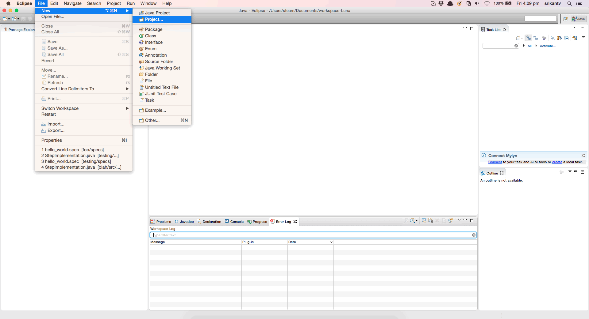
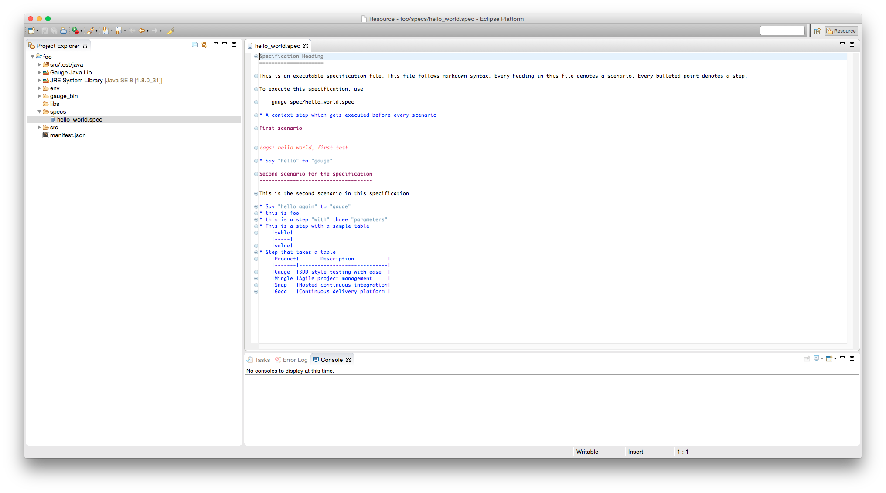
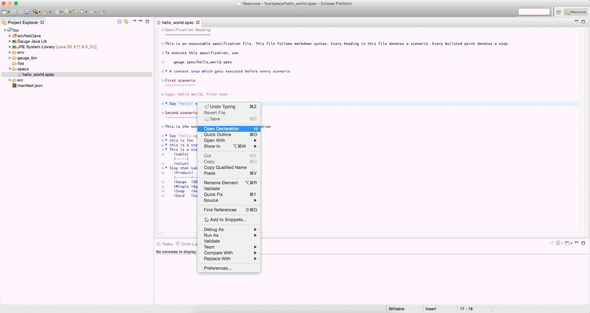
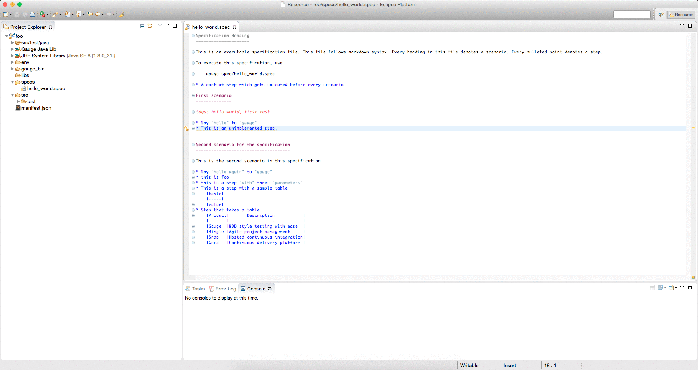
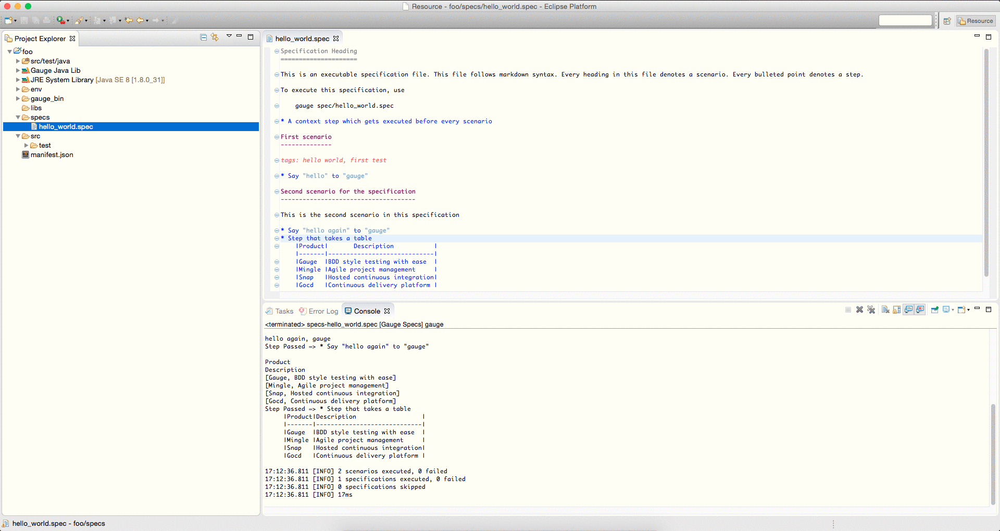
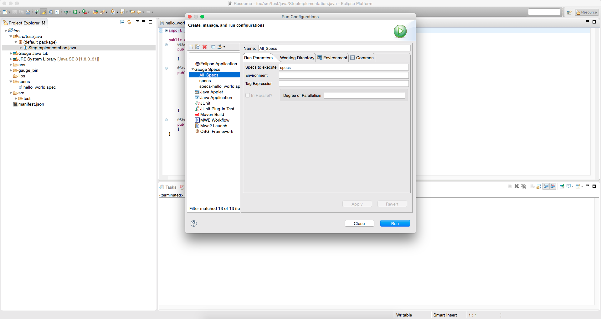

# Gauge Eclipse plugin Features

* [Project Creation](#project-creation)
* [Syntax Highlighting](#syntax-highlighting)
* [Auto completion](#auto-completion)
* [Navigation from step to implementation](#navigation-from-step-to-implementation)
* [Quick Fix for unimplemented steps](#quick-fix-for-unimplemented-steps)
* [Execution](#execution)

## Project Creation

* File -> New -> Project
* Type "Gauge" in the dialog that comes up.
* Choose "Gauge Spec Project", click "Next".
* Enter a project name, you may choose a different workspace if needed. Click "Finish"
* You should now see a Gauge project created.

*Note:* If gauge-java is not installed, it will download it for the first time.

## Syntax Highlighting

Gauge uses Markdown syntax, the specs are highlighted to reflect various elements.

Elements that are highlighted:
- Specs
- Scenarios
- Steps
- Step parameters (Static and Dynamic)
- Tags

## Auto Completion

The plugin can bring up a list of Steps that are defined/used in the project. The autocompletion works by pressing <kbd>Ctrl</kbd>+<kbd>Space</kbd>.

## Navigation from step to Implementation

This plugin allows you to Go to Definition of a Step, in a manner similar to doing it in Java code.

Simply Select the Step, Right-Click and Choose "Open Declaration".

Or, just press <kbd>F3</kbd> once you move your cursor to the Step.

## Quick Fix for unimplemented steps

The Plugin displays a warning when there is a Step with no matching implementation. The plugin also brings up a Quick-Fix option to implement the Step.

This option takes the user to a dialog where one can choose a Type to implement the Step Method, or Create a new Type, and implement the step there.

## Execution

The plugin allows user to execute Gauge Specs from within Eclipse. There are various ways to do this:

- Right-Click on a Spec file -> Run-As -> Gauge Specs : This will execute all scenarios in the selected spec file.
- Right-Click on "specs" folder -> Run-As -> Gauge Specs : This will execute all scenarios in all the spec files under that folder.
- Open Run Configurations, create your own run configuration.

